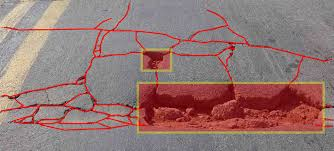
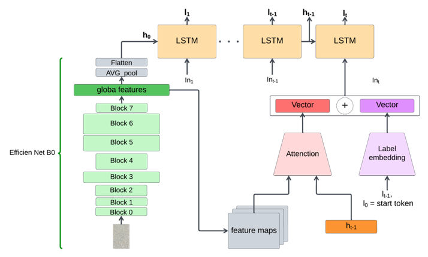

# Multi-Task Techniques for Road Weather Classification and Surface Anomaly Detection

<div align="center">
  
</div>

## Introduction

The automotive industry is experiencing a technological transformation, with machine learning playing a pivotal role in Advanced Driver Assistance Systems (ADAS). Neural network-based systems significantly enhance vehicle safety and control by accurately detecting various road conditions. This project focuses on three crucial tasks in road surface condition classification:

1. Estimating vehicle-road friction related to weather conditions.
2. Recognizing road surface material.
3. Identifying road irregularities.

These tasks are vital for enabling ADAS to dynamically adapt driving behavior, promoting both safety and efficiency.

## Methodology

### Dataset Restructuring

To address data-related challenges such as class imbalance and information shortage, the RSCD dataset was restructured. This restructuring was crucial for making the data more suitable for research needs and alleviating correlations among the training, validation, and test data.

### Model Development

An innovative model was developed, combining a Convolutional Neural Network (CNN) based on EfficientNet B0 with a Recurrent Neural Network (RNN), specifically a Long Short-Term Memory (LSTM) network. This architecture efficiently captures spatial and temporal correlations in the data. The integration of CNN and RNN allows the model to leverage data more effectively, improving the problem-solving capability.

### Reference Architecture

The reference architecture consists of:
- A CNN (encoder) that extracts a compact visual representation from the image.
- An RNN (decoder) that uses the encoding to generate a sequence of labels, modeling the dependencies between the labels themselves.

A pretrained ResNet-101 on ImageNet serves as the CNN, while the RNN employs an LSTM. An attention module enhances this setup by focusing on specific image parts during prediction, addressing small object representation with global features.

### Training Procedures

1. **Preliminary Training**: The CNN was initially trained with a simple classifier as the head, using Stochastic Gradient Descent (SGD) for 40 epochs, with early stopping after 3 epochs of no improvement.
2. **Final Model Training**: Incorporating the LSTM and attention modules, the final model was trained using the encoder from the preliminary step. The ADAM optimizer and a cyclic learning rate scheduler were employed, reducing the learning rate over three iterations. Data augmentation included random affine transformations and contrast changes.

### Inference Process

A greedy selection strategy was adopted instead of beam search, choosing the predicted output with the highest probability.

### Innovative Approaches

Two new methods, Predicted Label Alignment (PLA) and Minimum Loss Alignment (MLA), were introduced for label assignment without predefined order. These methods dynamically align the order of actual labels based on loss minimization during training, leading to faster training and eliminating issues such as repeated label assignment.

### Model Architecture

<div align="center">
  
</div>


## Project Structure

### Training Folder

Contains all training sessions conducted during this project:

- **Scripts**: Detailed procedures employed during training.
- **Performance on Test Set**: Evaluation results on the designated test set.
- **Performance on Training Set**: Assessment outcomes on the training set.
- **Model Weights**: The weights associated with the trained model.

### My Model Code

Includes the codebase for the proposed model, trained on the restructured dataset.

### Principal Results

Consolidates all significant findings and outcomes achieved throughout the research.

### Slides

Includes the presentation slides used for the final project presentation.

### Thesis

Contains the comprehensive final PDF document of the thesis.

### [DEMO](https://www.youtube.com/watch?v=Dcm0ewmD4eM)

## How to Execute

### Setup

Ensure the necessary dependencies are installed using the provided `requirements.txt`:

```bash
pip install -r requirements.txt
```

## Running the Model

- **Training**: Navigate to the "Training" folder and execute the training script.
- **Evaluation**: After training, evaluate the model using the test set script provided.
- **Results**: View performance metrics and model weights in the "Principal Results" section.
